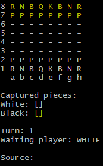

# 
♟️ Chess System Java ️

## ⚡ Sobre
Desenvolvido com base no curso [Java COMPLETO Programação Orientada a Objetos + Projetos](https://www.udemy.com/course/java-curso-completo/), esta aplicação é um jogo de Xadrez de terminal. Ele inclui tratamento de erros, suporte a jogadas especiais como promoção, roque e en passant, além de previsão dos movimentos das peças.

Durante o projeto, pude aplicar diversos tópicos de Programação Orientada a Objetos (POO) aprendidos no curso, incluindo:
- Encapsulamento
- Construtores
- Sobrescrita do método `ToString`
- Associações
- Herança
- Polimorfismo
- Exceções
- Membros estáticos
- Classe e método abstratos
- Composição

## 🛠️ Tecnologias
Esse projeto foi desenvolvido com as seguintes tecnologias:
- Java 17

## 🎮 Como jogar
1. Abra um terminal (Git Bash é o recomendado, pois é colorido)
2. Navegue até o diretório **/bin** (Eclipse) ou **/out** (IntelliJ). No meu caso (IntelliJ): `~/out/production/chess-system-java`.
3. Após entrar no diretório, digite `java application/Program` para rodar a aplicação.

#### 🔎 Observações
> **Peças:** Pawn (Peão): **P**, Rook (Torre): **R**, Knight (Cavalo): **N**, Bishop (Bispo): **B**, Queen (Rainha): **Q** e King (Rei): **K**.

  

- A mecânica do jogo é baseada em **linhas**(1, 2, 3, 4, 5, 6, 7, 8) e **colunas**(a, b, c, d, e, f, g, h)
- Para escolher uma peça é necessário selecionar primeiramente a **coluna** e logo em seguida(sem espaços) selecionar a **linha**, exemplo: **c2**
- Em **Captured pieces** o jogo armazena as peças capturadas.
- O **Turn** exibe o turno(rodada) em que o jogo está.
- **Waiting player** exibe qual é o jogador a jogar a próxima peça.
- **Source** é a origem, ou seja, a peça no qual o jogador irá jogar.
- **Target** é o destino, ou seja, o local no qual o jogador irá mover a peça.
- O jogo possui sistema de **Check** e **CheckMate**
- Alguns **movimentos especiais**:
  - Castling(Roque)
  - En Passant
  - Promotion(Promoção)